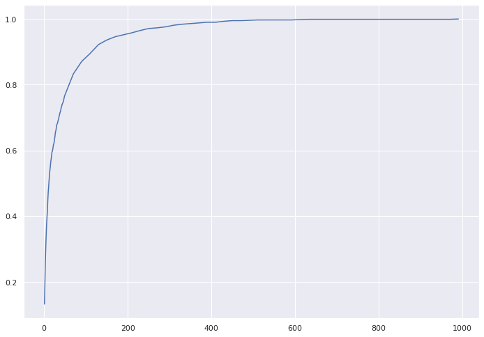

# image-search

## Translation

There weren't datasets with Persian captioned images, so we translated datasets with English captions to Persian with Google Translate using [googletrans](https://pypi.org/project/googletrans/) python package.

Then we evaluated these translations with a [sentence-bert](https://www.sbert.net/) bilingual model named [distiluse-base-multilingual-cased-v2](https://huggingface.co/sentence-transformers/distiluse-base-multilingual-cased-v2) trained for sentence similarity.
We calculated cosine similarity for embeddings of English caption and its Persian translation. The histogram of this score is shown below:

Finally, we filtered out top translations. Some samples of the final dataframe:

More details of translation part can be found in [this notebook](https://colab.research.google.com/drive/1XcwbdegPsuXKybDczD4d8d8LLH1QlQ8m).

## Evaluation

### Accuracy @ k

This metric is used for evaluating how good an image search of a model is.

Acc@k definition: Is the best image (the most related to the text query), among the top-k outputs of the model?

We calculated this metric for both models (CLIP & baseline) on two datasets:
* [flickr30k](https://paperswithcode.com/dataset/flickr30k): some intersections with the training data.
* [nocaps](https://nocaps.org/): completely zero-shot for models!

We can see the results of our CLIP model on a sample of flickr dataset with size 1000 (the right diagram has a log scale in its x-axis:

 

And hear are the results of our CLIP model on a sample of nocaps dataset with size 1000 (the right diagram has a log scale in its x-axis:

 

You can find more details in notebooks for [CLIP evaluation](https://colab.research.google.com/drive/1Rj9gFo4pTo1p-H2G3uw1viTJVJ8_-ZUF) and [baseline evaluation](https://colab.research.google.com/drive/13NwD0bE0JaR5L6fj26EyoDVhB5G7lgfX)

