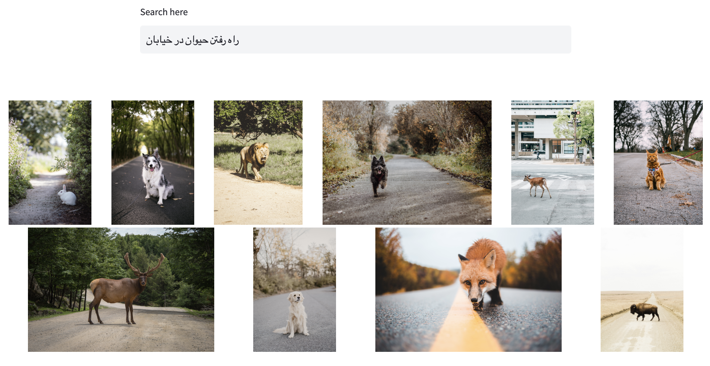

<span align="center">
<a href="https://huggingface.co/spaces/arman-aminian/farsi-image-search"></a>
<a href="https://huggingface.co/arman-aminian/farsi-image-search-text"></a>
<a href="https://huggingface.co/arman-aminian/farsi-image-search-vision"></a>
<a href="https://colab.research.google.com/drive/1QZWgNFy9NZxj2g4pQH_UDFVVg2eGUOrn?usp=sharing"></a>
<a href="https://colab.research.google.com/drive/1bsKbW0URSJGWwS6Nu33X_l3tHsLpqsF7?usp=sharing"></a>
</span>

# image-search

## CLIP

[CLIP](https://arxiv.org/abs/2103.00020) (Contrastive Language-Image Pre-Training) is a neural network trained on a variety of (image, text) pairs. It can be instructed in natural language to predict the most relevant text snippet, given an image, without directly optimizing for the task, similarly to the zero-shot capabilities of GPT-2 and 3.


With CLIP, we can train any two image and text encoder models together to relate images and text. It gives a score for relatedness of any given text and image! We fine-tuned [Vision Transformer(ViT)](https://huggingface.co/openai/clip-vit-base-patch32) as the vision encoder and the [roberta-zwnj-wnli-mean-tokens](https://huggingface.co/m3hrdadfi/roberta-zwnj-wnli-mean-tokens) as the farsi text encoder.

You can find how to train the model in the [CLIP training notebook](https://colab.research.google.com/drive/1Rj9gFo4pTo1p-H2G3uw1viTJVJ8_-ZUF).

## Data


To train (fine-tune) this model, we need examples that are pairs of images and Persian text that are the text associated with the image.
Since Persian data in this field is not easily available and manual labeling of data is costly, we decided to translate the available English data and obtain the other part of the data from the web crawling method.
### Translation

There weren't datasets with Persian captioned images, so we translated datasets with English captions to Persian with Google Translate using [googletrans](https://pypi.org/project/googletrans/) python package.

Then we evaluated these translations with a [sentence-bert](https://www.sbert.net/) bilingual model named [distiluse-base-multilingual-cased-v2](https://huggingface.co/sentence-transformers/distiluse-base-multilingual-cased-v2) trained for sentence similarity.
We calculated cosine similarity for embeddings of English caption and its Persian translation. The histogram of this score is shown below:


Finally, we filtered out top translations. Some samples of the final dataframe:


More details of translation part can be found in [this notebook](https://colab.research.google.com/drive/1XcwbdegPsuXKybDczD4d8d8LLH1QlQ8m).

### Crawler
For improve our model performance we crawled divar posts with it's [API](https://api.divar.ir). we saved image-title pairs in google drive.
You can see more details in this [notebook](https://github.com/NLP-Final-Projects/image-search/blob/master/src/data/load/get_posts.ipynb).
Some samples of final data is shown below:


## Evaluation

### Accuracy @ k

This metric is used for evaluating how good an image search of a model is.

Acc@k definition: Is the best image (the most related to the text query), among the top-k outputs of the model?

We calculated this metric for both models (CLIP & baseline) on two datasets:
* [flickr30k](https://paperswithcode.com/dataset/flickr30k): some intersections with the training data.
* [nocaps](https://nocaps.org/): completely zero-shot for models!

We can see the results of our CLIP model on a sample of flickr dataset with size 1000 (the right diagram has a log scale in its x-axis:

 

And hear are the results of our CLIP model on a sample of nocaps dataset with size 1000 (the right diagram has a log scale in its x-axis:

 

You can find more details in notebooks for [CLIP evaluation](https://colab.research.google.com/drive/1Rj9gFo4pTo1p-H2G3uw1viTJVJ8_-ZUF) and [baseline evaluation](https://colab.research.google.com/drive/13NwD0bE0JaR5L6fj26EyoDVhB5G7lgfX)


## Inference (How to use our model)

```python
from transformers import AutoModel, AutoTokenizer, CLIPVisionModel

# load finetuned vision encoder
vision_encoder = CLIPVisionModel.from_pretrained('arman-aminian/farsi-image-search-vision')
# load our finetuned text encoder and tokenizer
text_encoder = AutoModel.from_pretrained('arman-aminian/farsi-image-search-text')
text_tokenizer = AutoTokenizer.from_pretrained('arman-aminian/farsi-image-search-text')

search = ImageSearchDemo(vision_encoder, text_encoder, text_tokenizer, device='cuda')
# encode images
search.compute_image_embeddings(test.image.to_list())
search.image_search('ورزش کردن گروهی')
```


## [Web-based Demo](https://huggingface.co/spaces/arman-aminian/farsi-image-search)

We have deployed our model on Huggingface site, which you can query through https://huggingface.co/spaces/arman-aminian/farsi-image-search right now! Please keep in mind that our model had time and hardware limitations to train the model. Also, the demo searches for your query from a limited dataset and shows you the ten best results, so there may not be ten photos completely related to your query in the demo dataset that the model wants to find :D

In order for the result to be reliable, the dataset selected for the demo is completely new and taken from the [unsplash](https://unsplash.com/), and even other parts of this dataset have not been seen during the training of the model.

 

