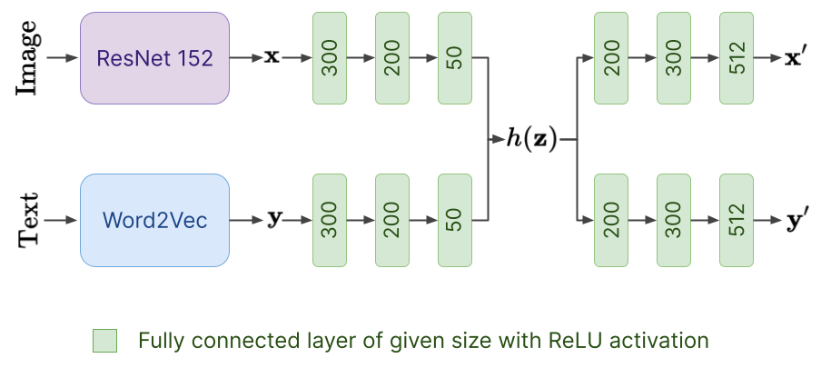

# Base Model

As a basic model we use a correlational network based on autoencoders that explicitly maximises correlation between image and text embedded vectors in addition to minimising the error of reconstructing the two views
This Model has two branches for encoding text and image and also two branches for decoding them

You can find how to train the model in the [BaseModel training notebook](https://colab.research.google.com/drive/1x5A9BJmNm-DLPBjF_mEFF3K3mAHqqAjg?usp=sharing).

 

For image encoding in encoder branch we use resnet-18 and for text encoding, we use the embedded vectors of trained [word2vec model](https://www.tensorflow.org/tutorials/text/word2vec) on captions.


## Inference (How to use our model)
It'll find the closest photo in the given folder to the given text.
```
image_demo = ImageSearchDemo()
text = ' خانه آپارتمان در شمال تهران'
image_name_set = glob.glob('/content/images/*.jpg')
top_num = 5
predictions_image_pathes = image_demo.image_search(text, image_name_set, top_num)
for img_path in predictions_image_pathes:
display(Img(img_path, width=100, height=100))
```
